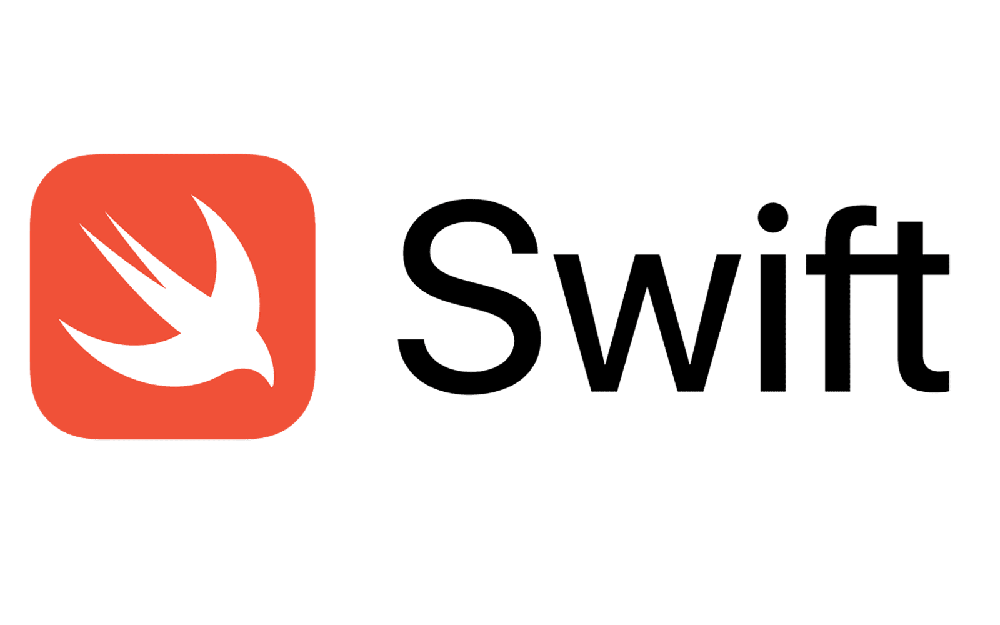
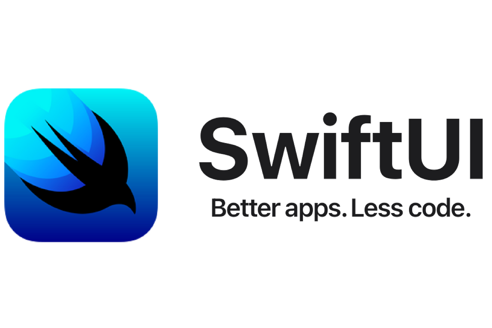

# JMGWorkScape App Documentation

<!-- TABLE OF CONTENTS -->

  
Table of Contents

  <ol>
    <li>
      <a href="#about-our-app">About our app</a>
    </li>
    <li>
      <a href="#built-with">Built With</a>
    </li>
    <li><a href="#how-to-run-our-app">How to run our app</a></li>
    <li><a href="#app-view">App View</a></li>
    <li><a href="#features">Features</a>
        <ul>
            <li><a href="#prerequisites">Prerequisites</a></li>
            <li><a href="#installation">Installation</a></li>
        </ul>
    </li>
    <li><a href="#contributers">Contributers</a></li>
    <li><a href="#developer-notes">Developer Notes</a></li>
    <li><a href="#acknowledgments">Acknowledgments</a></li>
  </ol>

## About our app

This app was created for the company **JMG Landscape**. The purpose of the app is to manage and store customers' house data. From the customers' houses data, our app creates a route for each day depending from a customer's house data if work needed to be done that day of the week. Once a job is completed for a house, our app offers a feature that can create invoives for a house and deliver it to our customers as a pdf format.

## Built With

## How to run our app

This requires to have Xcode download. You can run our app in iOS simulator that is running iOS 16+.

## App View

## Features

### Get a House's Details

### Scalability of Houses Data

### Search Bar

### Grid View of all Houses

### Create an Invoice

### Add a House

### Remove a House

### Get Route for Current Day

<!-- - Co-developed and deployed JMGWorkScape, an iOS app for JMG Landscape, using Swift and SwiftUI.
- Implemented a Trie-based search bar and efficient data management with dictionaries.
- Created a PDF invoice generation feature, streamlining client billing.
- Managed GitHub documentation, including issue tracking, branch protection, and pull requests reviews.
- Researched AppStore deployment and applied for the Apple Developer Program.
- Coordinated project milestones through active participation in meetings.
- Contributed 12 hours per week over 2 months to deliver a functional, well-documented app.
 -->

## Contributers

## Developer Notes

links for apple developer membership information:

1. https://developer.apple.com/support/enrollment/
2. https://atlc.apple.com/downloads/AppleDeveloperProgram_FeeWaiverforEducation_OnboardingKit.pdf?cid=pm-enus-nwl-3pp-edu-dis-adp
3. https://developer.apple.com/documentation/xcode/distributing-your-app-to-registered-devices
4. https://developer.apple.com/support/certificates/

link for figma design prototype:
https://www.figma.com/proto/o7xaPuZht7zynZkDMCQAkV/App-Design-Ver.-1.0?t=bf4mZlCK7fDHkCb5-1

video for data:
https://www.youtube.com/watch?v=krRkm8w22A8

[contributors-shield]: https://img.shields.io/github/contributors/othneildrew/Best-README-Template.svg?style=for-the-badge
[contributors-url]: https://github.com/othneildrew/Best-README-Template/graphs/contributors
[forks-shield]: https://img.shields.io/github/forks/othneildrew/Best-README-Template.svg?style=for-the-badge
[forks-url]: https://github.com/othneildrew/Best-README-Template/network/members
[stars-shield]: https://img.shields.io/github/stars/othneildrew/Best-README-Template.svg?style=for-the-badge
[stars-url]: https://github.com/othneildrew/Best-README-Template/stargazers
[issues-shield]: https://img.shields.io/github/issues/othneildrew/Best-README-Template.svg?style=for-the-badge
[issues-url]: https://github.com/othneildrew/Best-README-Template/issues
[license-shield]: https://img.shields.io/github/license/othneildrew/Best-README-Template.svg?style=for-the-badge
[license-url]: https://github.com/othneildrew/Best-README-Template/blob/master/LICENSE.txt
[linkedin-shield]: https://img.shields.io/badge/-LinkedIn-black.svg?style=for-the-badge&logo=linkedin&colorB=555
[linkedin-url]: https://linkedin.com/in/othneildrew
[product-screenshot]: images/screenshot.png
[Next.js]: https://img.shields.io/badge/next.js-000000?style=for-the-badge&logo=nextdotjs&logoColor=white
[Next-url]: https://nextjs.org/
[React.js]: https://img.shields.io/badge/React-20232A?style=for-the-badge&logo=react&logoColor=61DAFB
[React-url]: https://reactjs.org/
[Vue.js]: https://img.shields.io/badge/Vue.js-35495E?style=for-the-badge&logo=vuedotjs&logoColor=4FC08D
[Vue-url]: https://vuejs.org/
[Angular.io]: https://img.shields.io/badge/Angular-DD0031?style=for-the-badge&logo=angular&logoColor=white
[Angular-url]: https://angular.io/
[Svelte.dev]: https://img.shields.io/badge/Svelte-4A4A55?style=for-the-badge&logo=svelte&logoColor=FF3E00
[Svelte-url]: https://svelte.dev/
[Laravel.com]: https://img.shields.io/badge/Laravel-FF2D20?style=for-the-badge&logo=laravel&logoColor=white
[Laravel-url]: https://laravel.com
[Bootstrap.com]: https://img.shields.io/badge/Bootstrap-563D7C?style=for-the-badge&logo=bootstrap&logoColor=white
[Bootstrap-url]: https://getbootstrap.com
[JQuery.com]: https://img.shields.io/badge/jQuery-0769AD?style=for-the-badge&logo=jquery&logoColor=white
[JQuery-url]: https://jquery.com
