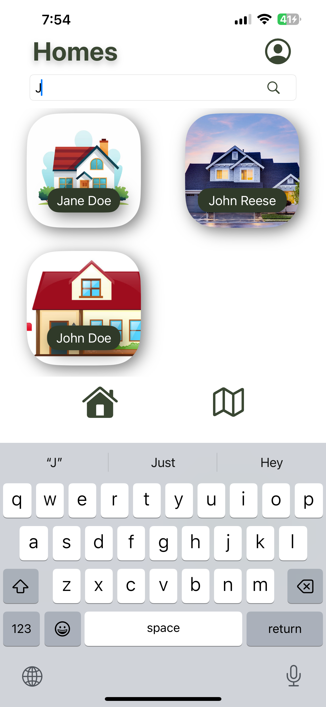
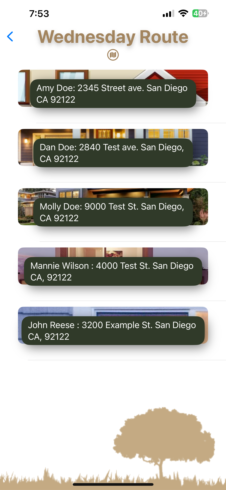
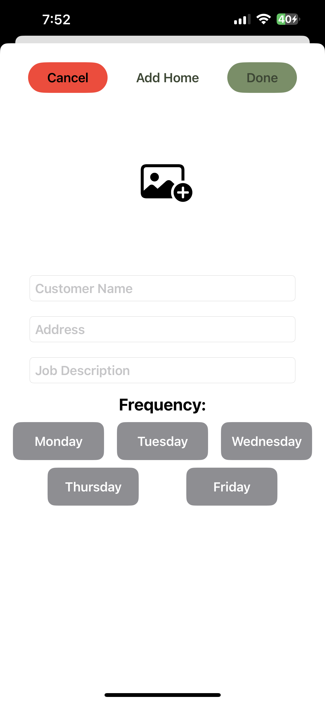
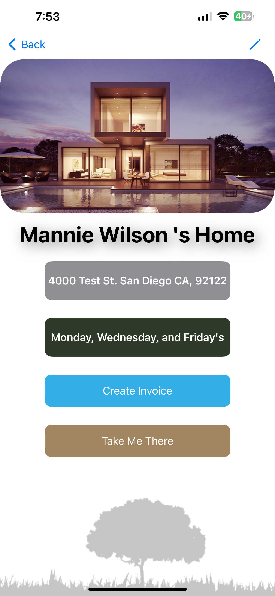
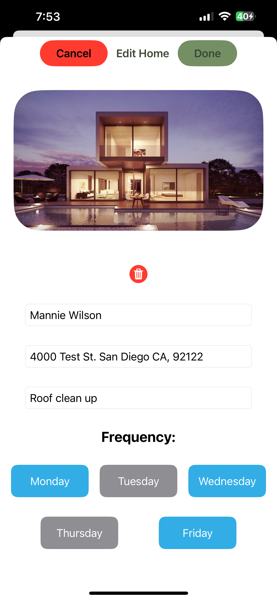
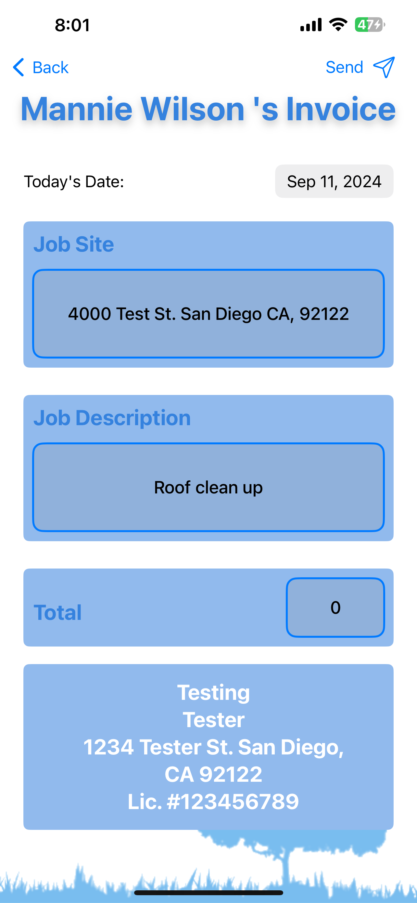

# JMGWorkScape App Documentation

<!-- TABLE OF CONTENTS -->

  
Table of Contents

  <ol>
    <li>
      <a href="#about-our-app">About our app</a>
    </li>
        <li><a href="#app-view">App View</a></li>
    <li>
      <a href="#built-with">Built With</a>
    </li>
    <li><a href="#how-to-run-our-app">How to run our app</a></li>
    <li><a href="#features">Features</a>
        <ul>
            <li><a href="#get-house-details">Get House Details</a></li>
            <li><a href="#scalability-of-houses-data">Scalability of Houses Data</a></li>
            <li><a href="#search-bar">Search Bar</a></li>
            <li><a href="#add-a-house">Add a House</a></li>
            <li><a href="#remove-a-house">Remove a House</a></li>
            <li><a href="#get-route-for-current-day">Get Route for Current Day</a></li>
        </ul>
    </li>
    <li><a href="#contributers">Contributers</a></li>
    <li><a href="#developer-notes">Developer Notes</a></li>
    <li><a href="#acknowledgments">Acknowledgments</a></li>
  </ol>

## About our app

This app was created for the company **JMG Landscape**. The purpose of the app is to manage and store customers' house data. From the customers' houses data, our app creates a route for each day depending from a customer's house data if work needed to be done that day of the week. Once a job is completed for a house, our app offers a feature that can create invoives for a house and deliver it to our customers as a pdf format.

## App View
  

    
    <!--  -->
    
    
    
    
    
    
    
  

## Built With

 

 

## How to run our app

This requires to have Xcode download. You can run our app in iOS simulator that is running iOS 16+.

## Features

### Get House Details

In our application, users can access detailed information about a house by selecting it from the grid view. This feature is powered by the `HouseSearchManager` class, which manages house data efficiently using a combination of dictionaries and a Trie data structure.

#### How It Works

1. **Selection:** When a user taps on a house in the grid, the application retrieves detailed information about that house.
   
2. **Data Retrieval:** The `HouseSearchManager` class maintains a dictionary where each house name maps to a secondary dictionary. This secondary dictionary maps addresses to `House` objects. This setup allows for quick lookups of house details based on both name and address.

3. **Display Details:** Once a house is selected, the application displays a detailed view that includes:
   - The customer's name
   - The house address
   - Additional options such as creating an invoice or opening Apple Maps for directions to the house.

4. **Features:**
   - **Create Invoice:** Users can generate an invoice directly from the details screen.
   - **Open in Apple Maps:** Users can tap a button to open Apple Maps and get directions to the house’s address.

### Scalability of Houses Data

Our application is built to efficiently handle a large volume of house data, including scenarios where multiple houses may share the same customer name but have different addresses. 

#### Key Features

- **Dual-Level Data Structure:** The `HouseSearchManager` uses a two-level dictionary structure where:
  - The primary dictionary maps house names to a secondary dictionary.
  - The secondary dictionary maps addresses to `House` objects.

  This design allows for efficient storage and retrieval of house information even when multiple houses share the same name but have unique addresses.

- **Efficient Prefix-Based Search:** The app employs a Trie data structure for managing house names, which supports efficient prefix-based searches. This ensures that users can quickly find houses by partial names, even as the number of houses grows.

- **Unique Address Management:** A set of unique addresses is maintained to ensure address uniqueness and facilitate quick lookups. This prevents duplicate entries and ensures accurate management of house locations.

- **Performance Optimization:** The system is designed to handle scaling smoothly. As the volume of house data increases, the app efficiently manages storing, retrieving, and deleting house information without affecting performance. The `HouseSearchManager` ensures that operations such as adding, updating, or removing houses are processed efficiently.

This architecture supports the seamless expansion of house data, allowing the app to perform robustly and maintain high performance as the dataset grows.

### Search Bar
The search bar feature in our application allows users to efficiently search for houses based on a prefix of their names. This is implemented using the `houseNamesWithPrefix(_ prefix: String)` function from the `HouseSearchManager` class.

#### Functionality

- **Purpose:** To retrieve all houses whose names start with a specified prefix. This helps users quickly find houses that match the beginning of their names, improving search efficiency.

#### Implementation

- **Function:** `houseNamesWithPrefix(_ prefix: String) -> [House]`
  - **Parameter:** `prefix` - A `String` representing the prefix to search for in house names.
  - **Returns:** An array of `House` objects whose names start with the given prefix.

#### How It Works

1. **Prefix Traversal:** The function begins at the root node of the Trie data structure and traverses through the Trie nodes according to each character in the provided prefix.
2. **Node Check:** For each character in the prefix, it checks whether the corresponding child node exists. If at any point a node for the current character is missing, the function returns an empty array, indicating no matches.
3. **Collect Words:** Once the traversal reaches the end of the prefix, the function collects all words (house names) that share this prefix using the `collectWords` method.
4. **Retrieve Houses:** It then uses the `getHouses` method using the array of house names from `collectWords` to fetch the `House` objects associated with the collected names.

This implementation ensures that the search for house names is both quick and responsive, even with large datasets.

<!-- ### Grid View of all Houses -->

<!-- ### Create an Invoice -->

### Add a House

Adding a house to the system involves updating multiple components to ensure that the new house is stored efficiently and can be retrieved quickly. The `HouseSearchManager` class handles this process through the following steps:

#### Process Overview

1. **Data Insertion:**
   - **Dictionary Update:** The house is added to the primary dictionary, where the house name maps to a secondary dictionary. The secondary dictionary maps the house address to the `House` object. This dual-level structure allows efficient access and management of houses based on both their names and addresses.
   - **Address Set Update:** The address of the new house is also added to a set of unique addresses. This ensures that each address is distinct and supports quick lookups.

2. **Trie Insertion:**
   - **Prefix-Based Search:** The house name is inserted into a Trie data structure. The Trie supports efficient prefix-based searches, allowing users to quickly find houses by partial names. Each character of the house name is processed to build the Trie, with nodes created as necessary.

3. **Data Integrity:**
   - **Address Uniqueness:** By maintaining a set of unique addresses, the `HouseSearchManager` prevents duplicate entries and ensures that each address is associated with only one house.

4. **Performance Considerations:**
   - **Efficient Handling:** The process is designed to handle a growing number of houses efficiently. The underlying data structures (dictionary and Trie) ensure that adding a house does not compromise performance, even as the dataset expands.

#### Code Implementation

In the `HouseSearchManager` class, the `init(_ housesArray: [House])` method initializes the manager with an array of `House` objects. During this initialization:

- Each house is added to the primary dictionary and Trie.
- The address of each house is inserted into the set of unique addresses.

When adding a single house, similar steps are followed to update the primary dictionary, Trie, and address set, ensuring the new house is properly integrated into the system.

This approach ensures that adding a house is efficient and maintains the performance and accuracy of the house management system.

### Remove a House

Removing a house from the system involves updating multiple components to ensure the house is completely and efficiently removed. The `HouseSearchManager` class handles this process through the following steps:

#### Process Overview

1. **Data Removal:**
   - **Dictionary Update:** The house is removed from the primary dictionary. This involves locating the house by its name and address, and then deleting the entry from the secondary dictionary that maps addresses to `House` objects.
   - **Address Set Update:** The house's address is removed from the set of unique addresses. This ensures that the address is no longer associated with any house in the system.

2. **Trie Update:**
   - **Prefix-Based Search:** The house name is removed from the Trie data structure. This involves traversing the Trie to find and delete the nodes associated with the house name. The Trie is updated to reflect the removal, ensuring that searches for this house name are accurately processed.

3. **Data Integrity:**
   - **Node Cleanup:** During the Trie update, nodes that are no longer part of any house name are cleaned up. This involves checking if a node can be deleted (i.e., if it has no children and does not mark the end of another word) and removing it if possible.

4. **Performance Considerations:**
   - **Efficient Handling:** The process is designed to handle removals efficiently, even as the dataset grows. The dictionary and Trie updates are performed to maintain performance and ensure that the system remains responsive.

#### Code Implementation

In the `HouseSearchManager` class, the `remove(_ house: House)` method is responsible for removing a house. This method performs the following actions:

- **Update Dictionary:** Removes the house from the dictionary by accessing the house name and address.
- **Update Address Set:** Removes the house’s address from the set of unique addresses.
- **Update Trie:** Calls the `removeFromTrie(_:currentNode:index:)` method to delete the house name from the Trie and perform any necessary node cleanup.
- **Adjust Count:** Decrements the count of houses managed by the `HouseSearchManager`.

This approach ensures that a house is completely removed from the system, including its entries in the dictionary, address set, and Trie, while maintaining overall system performance and data integrity.

### Get Route for Current Day

The `RouteScreen` view provides a comprehensive display of houses scheduled for work on the current weekday. This feature allows users to view, manage, and navigate to houses based on their work schedule for the day. Here’s how the `RouteScreen` handles this functionality:

#### Overview

1. **Determine Current Weekday:**
   - The screen starts by determining the current weekday using the `getCurrentWeekday()` function. This ensures that the displayed information is relevant to today’s schedule.

2. **Display Houses Scheduled for Work:**
   - **Data Filtering:** The view filters the list of houses to include only those scheduled for work on the current weekday. This is achieved using the `editHouses` array, which is populated by filtering the `houses` array based on the weekday.
   - **UI Presentation:** Houses are displayed in a list format, with each entry showing the house’s image (or a placeholder if no image is available), name, and address. The list uses a custom style and background to enhance readability.

3. **Interactive Features:**
   - **House Details:** Users can tap on a house to navigate to the `HomeDetailsScreen`, where they can view detailed information about the selected house.
   - **Swipe-to-Delete:** Each house entry includes a swipe-to-delete action. This allows users to remove a house from the list of scheduled work for the day. The deletion is handled efficiently, updating the `editHouses` array and reflecting the change in the UI.

4. **Display Non-Workdays:**
   - If today is not a scheduled workday, the view displays a message indicating that no work is scheduled for the day. This ensures users are informed about their schedule status.

5. **Navigation and Layout:**
   - **Toolbar:** The toolbar at the top of the screen displays the current weekday, providing context to the user about the route being shown.
   - **Navigation:** The `RouteScreen` includes navigation links to other screens, such as the `HomeDetailsScreen`, based on user interactions.

6. **Dynamic Content Updates:**
   - The view dynamically updates its content when it appears, filtering houses according to the current weekday and ensuring that the displayed information is always up-to-date.

#### Code Implementation

- **Filtering Logic:** Utilizes the `onAppear` modifier to filter and assign houses to `editHouses` and `remainingHouses` based on the current weekday.
- **UI Elements:** Uses `GeometryReader`, `ZStack`, and `List` to manage layout and styling, including custom colors and images.
- **State Management:** Employs `@State` variables to manage navigation and the editing state of houses.

This feature provides users with an organized view of their daily work schedule, including interactive options to manage and view house details, ensuring a seamless and efficient workflow.

## Contributers

## Developer Notes

links for apple developer membership information:

1. https://developer.apple.com/support/enrollment/
2. https://atlc.apple.com/downloads/AppleDeveloperProgram_FeeWaiverforEducation_OnboardingKit.pdf?cid=pm-enus-nwl-3pp-edu-dis-adp
3. https://developer.apple.com/documentation/xcode/distributing-your-app-to-registered-devices
4. https://developer.apple.com/support/certificates/

link for figma design prototype:
https://www.figma.com/proto/o7xaPuZht7zynZkDMCQAkV/App-Design-Ver.-1.0?t=bf4mZlCK7fDHkCb5-1

video for data:
https://www.youtube.com/watch?v=krRkm8w22A8
